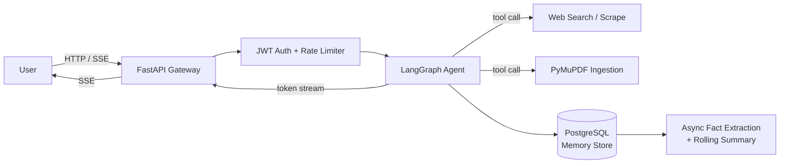
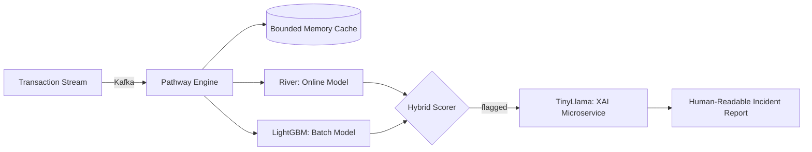

<div align="center">

# Saksham Vijay

**Agentic AI Engineer · Full-Stack Developer**

[](mailto:sakshamvijay07@gmail.com)
[](https://linkedin.com/in/saksham-vijay-69541a288)
[](https://github.com/Sakshamvijay-078)

</div>

```
$ whoami
saksham vijay — agentic AI engineer & full-stack developer
final-year B.Tech (EE), IIT Jammu — building systems that survive contact with real traffic

$ status
shipping   -> Panda, an agentic LLM platform (LangGraph + FastAPI, SSE streaming)
shipped    -> fintech app in production at Techible · fraud pipeline at 100+ tx/sec
learning   -> Kubernetes, Terraform, distributed systems
open_to    -> SDE / AI-ML internships & full-time roles
```

<!--CF_STATS:START-->

<sub>static — wire up `scripts/update_stats.py` below to make this self-updating</sub>
<!--CF_STATS:END-->


---

## Now building — Panda

*FastAPI · LangGraph · LangChain · Groq (Llama 3) · Next.js 14 · Supabase · PostgreSQL*

Agentic chat platform with tool-using LangGraph workflows and real-time token streaming over SSE.



**Engineering decisions that mattered:**
- Rolling summaries with auto-compression instead of raw history replay — keeps context bounded as conversations grow, at the cost of some recall fidelity.
- Fact extraction runs async and off the critical path, so memory writes never add latency to the user-facing stream.
- BYOK key encryption + JWT validation + rate limiting, added once the project moved from "working" to "exposed to the internet."

[Live demo](#) · [Source](#)

---

## Selected work

<details>
<summary><strong>Real-time fraud detection system</strong> — Kafka · Pathway · LightGBM · TinyLlama · AWS EC2</summary>

<br>



Ingests 100+ transactions/sec with bounded memory caching. The hybrid scorer exists because online learning alone (River) reacts fast but drifts, and batch models alone (LightGBM) are accurate but stale — combining both trades a bit of complexity for stability under concept drift. Flags aren't just scores: a locally quantized TinyLlama model turns each flag into a narrative report a non-ML analyst can act on.

[Source](#)

</details>

<details>
<summary><strong>LiSenNet — lightweight speech enhancement</strong> — PyTorch · Signal Processing</summary>

<br>

Independent implementation and extension of LiSenNet (ICASSP 2025) on VoiceBank-DEMAND. Added a noise classifier, a skip-refinement block, and swapped in an SI-SNR loss — pushing PESQ to **3.094** against the paper's reported **3.070**.

[Source](#)

</details>

<details>
<summary><strong>KnightShift — real-time multiplayer chess</strong> — React · Node.js · WebSockets · MongoDB</summary>

<br>

Dual-backend architecture: WebSockets carry low-latency gameplay state, Express/MongoDB handle auth and persistent game storage — split deliberately so a slow auth query can never stall a live move. Global matchmaking, an AI opponent, and graceful reconnection handling for dropped connections.

[Live demo](#) · [Source](#)

</details>

---

## Experience

**Mobile App Developer Intern, Techible** (May–Sept 2025) — React Native crypto fintech app: wallet management, Visa card onboarding, live crypto-payment infra, Veriff-based KYC, referral/analytics systems.

---

## Stack

```yaml
languages: [C++, Python, TypeScript, JavaScript, SQL, Bash]
ai_ml:     [PyTorch, TensorFlow, LangChain, LangGraph, Groq, OpenCV]
backend:   [FastAPI, Node.js, GraphQL, WebSockets, REST]
frontend:  [React, Next.js, React Native, TailwindCSS]
data:      [PostgreSQL, MongoDB, Redis, Apache Kafka, Pathway, Supabase]
devops:    [Docker, AWS (EC2 / S3 / Lambda), Git, Linux]
learning:  [Kubernetes, Terraform, distributed systems]
```

---

## Activity

<picture>
  <source media="(prefers-color-scheme: dark)" srcset="https://github-readme-stats.vercel.app/api?username=Sakshamvijay-078&show_icons=true&bg_color=0D1117&title_color=FFFFFF&text_color=C9D1D9&icon_color=58A6FF&border_color=30363D">
  
</picture>
<picture>
  <source media="(prefers-color-scheme: dark)" srcset="https://streak-stats.demolab.com?user=Sakshamvijay-078&background=0D1117&border=30363D&ring=58A6FF&fire=58A6FF&currStreakLabel=FFFFFF&sideLabels=C9D1D9&dates=8B949E&currStreakNum=FFFFFF&sideNums=FFFFFF">
  
</picture>

<sub>The Codeforces badge above is wired for `.github/workflows/update-stats.yml`, which re-fetches my rating via the Codeforces API on a schedule and commits it back automatically — see `/scripts/update_stats.py`.</sub>

---

<div align="center">

*Currently optimizing two things: agent latency, and my Codeforces rating.*

</div>
